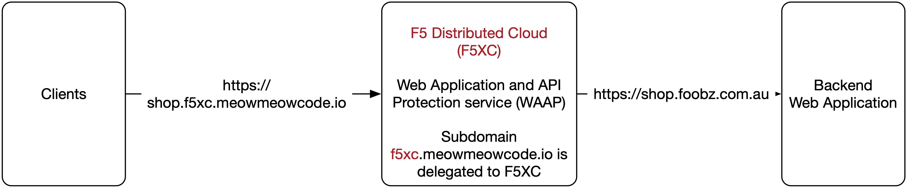

# How to use Web Application and API Protection service on the F5 Distributed Cloud

## Overview
The F5 Distributed Cloud ( F5XC, https://www.f5.com/cloud ) provides SaaS-based services in security, networking, and application management. 

The Web Application and API Protection (WAAP) service is part of the security services that the F5XC provides, it is a L7 based firewall protection service catered to applications serving web and/or API traffic.

## Solution

This repo includes sample automation code required to build a WAAP service on the F5XC to protect an online shopping cart.

The overall architecture looks like below.



This repo uses automation to build the WAAP service, and creates the following components in that process,

 - a HTTP load balancer
 - an origin pool
 - a monitor
 - an app firewall
 - a security policy

The HTTP(s) load balancer accepts client traffic and proxy(s) them to the backend application. 

A DNS subdomain is delegated to the F5XC beforehand ( https://docs.cloud.f5.com/docs/how-to/app-networking/domain-delegation ), as it is required for automatic certificate management. In this example, 'f5xc' subdomain to 'meowmeowcode.io' is delegated to the F5XC. 'shop' as the hostname is chosen to represent the service.

The origin pool contains a single member pointing to a sample online shopping cart as the backend application.

The monitor provides custom health monitoring for the application.

The app firewall provides **signature** based protection for all shopping cart related traffic (API and non-API traffic).

The security policy is created to bring in API protection. It has a custom rule list comprising individual rules that apply an action (Allow/Deny) based upon the group name of an API request. The group name of an API request is defined withint an API definition swagger file (i.e., shopazone-swagger.json).

Inside of this swagger file, individual API's are put into assigned groups via tags. In the below example, after this swagger file is imported, the group name 'ves-io-api-def-myshop-apidef-read' is created (automation code added in additional texts) and then referenced by an individual rule.

```python
...
"x-volterra-api-group": "read",
...
```
Please note, within the Terraform provider, a **volterra_api_definition** resource (defined within api-definition.tf) expects a value for **swagger_specs**. This value is only available after uploading the swagger file through the GUI prior (obtain value within portal).

## Terraform Provider

The Terraform provider expects the followings for API calls. Alternatively, you can provide a .p12 certificate bundle file per this ( https://registry.terraform.io/providers/volterraedge/volterra/latest/docs#example-usage )

```python
provider "volterra" {
  api_cert = var.api_cert
  api_key  = var.api_key
  url      = var.api_url
}
```
You need to create a credential within F5XC portal in the form of an API certificate and extract the cert and key seperately. Take a look at this ( https://docs.cloud.f5.com/docs/how-to/user-mgmt/credentials#my-credentials ) for details.

```python
openssl pkcs12 -info -in f5-apac-ent.console.ves.volterra.io.api-creds.p12 -nokeys -out certificate.cert 

openssl pkcs12 -info -in f5-apac-ent.console.ves.volterra.io.api-creds.p12 -nodes -nocerts -out private.key 
```
## Inputs

| Name | Description | Type | Example | Required |
|------|-------------|------|---------|:--------:|
| <a name="input_api_cert"></a> [api\_cert](#input\_api\_cert) | Certificate for F5XC API access | `string` | `"./files/certificate.cert"` | no |
| <a name="input_api_key"></a> [api\_key](#input\_api\_key) | Private key for F5XC API access | `string` | `"./files/private_key.key"` | no |
| <a name="input_api_url"></a> [api\_url](#input\_api\_url) | API URL for your F5XC tenant | `string` | `"https://f5-apac-ent.console.ves.volterra.io/api"` | no |
| <a name="input_app_domain"></a> [app\_domain](#input\_app\_domain) | FQDN(s) for the app. | `list` |  [ <br> "shop.f5xc.meowmeowcode.io" <br> ] | no |
| <a name="input_enable_hsts"></a> [enable\_hsts](#input\_enable\_hsts) | Flag to enable hsts for HTTPS loadbalancer | `bool` | `true` | no |
| <a name="input_enable_redirect"></a> [enable\_redirect](#input\_enable\_redirect) | Flag to enable http redirect to HTTPS loadbalancer | `bool` | `true` | no |
| <a name="input_origin_server_dns_name"></a> [origin\_server\_dns\_name](#input\_origin\_server\_dns\_name) | Origin server's publicly resolvable dns name | `list` | [<br>  "shop.origin.com.au"<br>] | no |
| <a name="input_origin_server_sni"></a> [origin\_server\_sni](#input\_origin\_server\_sni) | Origin server's SNI value | `string` | `"shop.foobz.com.au"` | no |
| <a name="input_volterra_namespace"></a> [volterra\_namespace](#input\_volterra\_namespace) | F5XC app namespace where the object will be created. This cannot be system or shared ns. | `string` | `"shop"` | no |
| <a name="input_volterra_namespace_exists"></a> [volterra\_namespace\_exists](#input\_volterra\_namespace\_exists) | Flag to create or use existing volterra namespace | `string` | `true` | no |
| <a name="input_web_app_name"></a> [web\_app\_name](#input\_web\_app\_name) | Web App Name. Also used as a prefix in names of related resources. | `string` | `"shop"` | no |

## Outputs

| Name | Description |
|------|-------------|
| <a name="output_f5_distributed_cloud_protected_app_url"></a> [f5\_distributed\_cloud\_protected\_app\_url](#output\_f5\_distributed\_cloud\_protected\_app\_url) | Domain VIP to access the web app |

## Conclusion

Once Terraform apply completes, the following is printed.

```python
WAAP_URL_for_protected_application = "https://shop.f5xc.meowmeowcode.io"
```

Point your client traffic to the above URL and they will be protected by WAAP.


